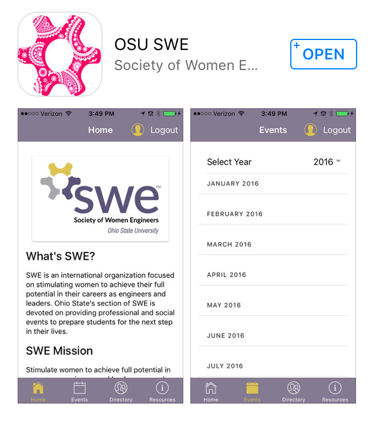

# SWE_Member_Attendance_Project

## Background ##

  

This customized mobile application tracks member involvement, sends out notifications generated from a consolidated event calendar and creates a centralized location for tools and resources specific to the organization. Members sign into the app to record their attendance for each event. Individual and group attendance is stored and tracked, improving the speed and simplicity of event check-in logistics. All event details can be found by clicking on events that are filtered within the calendar. Events will automatically send push notifications to each user’s phone 24 hours prior, reminding them to attend. A centralized database for SWE contacts and links allows members to easily find the information they need to stay connected. This application is currently available for Android and IOS.

In this project, I use the CMS data maintained by OSU SWE to perform SQL queries such as:

* Calculating all members' attendance points
* Calculating how many members attend each event
* Calculating the number of members in each graduation year
* Calculating the number of members in each engineering major
* Finding all active members

## Instructions for Loading Data ##
1. Change directory to SWE_Member_Attendance_Project/src
2. Enter `> sqlite3`
3. Enter `> .read create_member_attendance.sql`
4. Enter `> .mode csv`
5. Enter `> .import ../csv/users.csv USERS`
6. Enter `> .import ../csv/events.csv EVENTS`
7. Enter `> .import ../csv/attendances.csv ATTENDANCE`
8. Enter `> .save swe_member_event_attendance.db`
9. Enter `> .exit`
10. To open database again, enter `> .open swe_member_event_attendance.db`

## Instructions for Running Queries ##
Change directory to SWE_Member_Attendance_Project/src

List of Queries:
* calculate_event_points.sql
* calculate_member_graduationYears.sql
* calculate_member_majors.sql
* calculate_member_points.sql
* find_active_members.sql

1. To execute calculate_event_points.sql, enter `> .read calculate_event_points.sql`
2. To execute another query, repeat step 1 with another query from the List of Queries.
